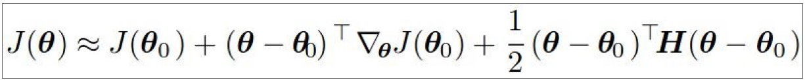
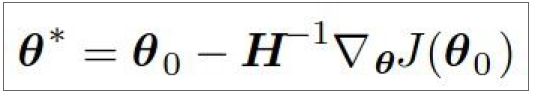

# Training Neural Networks, Part 2

- Parameter update schemes
  - sgd 
  ```Python
      # gradient only offer us a direction, move how big, it is up to you.
      x += - learning_rate * dx 
  ```
  - Momentum
  ```Python
      # not just friction, also change direction not pure follow gradient
      # and it is the combination of recent updates.
      v = mu * v - learning_rate * dx 
      x += v
  ```
  - Nesterov Momentum update
  ```Python
      # update direction depends on previous update direc and (current + epsion)'s direc
      v_prev = v
      # v is the momentum update
      v = mu * v - learning_rate * dx
      x += -mu * v_prev + (1+mu) * v
  ```
  - nag: Nesterov Accelerated Gradient
  - adagrad
  ```Python
      # adagrad try to sovle the problem, how long we move.
      # as long as step size goes, the updates is toward smaller.
      cache += dx**2
      x += -learning_rate * dx / (np.sqrt(cache) + 1e-7)
  ```
  - adadelta
  - rmsprop
  ```Python
      # simply decay the cache based on adagrad
      cache = decay_rate * cache + (1 - decay_rate) * dx ** 2
      x += - learning_rate * dx / (np.sqrit(cache) + 1e-7 )
  ```
  - adam
  ```Python
      # combine rmsprop and Momentum
      # it is a momentum-style to find the right direction and
      # determine how big to move a step
      m = beta1*m + (1-beta1)*dx
      v = beta2*v + (1-beta2)*(dx**2)
      x += - learning_rate * m / (np.sqrt(v) + 1e-7)
  ```
  ```Python
      # the bias correction rule increase the updates at starts
      # due to m,v initialize at zero.
      m = beta1*m + (1-beta1)*dx
      v = beta2*v + (1-beta2)*(dx**2)
      # t is the step number
      mb = m / (1-beta1**t) # correct bias
      vb = v / (1-beta2**t) # correct bias
      x += - learning_rate * mb / (np.sqrt(vb) + 1e-7)
  ```
  - Second order optimization methods
    - basic principle
      
      
    - No hyperparameters but need to inverse H
    - Methods
      - Quasi-Newtion methods (BGFS most popular)
      - BFGS (Limited memory BFGS)
      - L-BFGS
        - works very well in full batch, deterministic mode
        - not well for mini-batch setting
  
- Learning rate schedule
  
- Gradient checking

- Model ensembles
  - 2% improvement
  - ** a small boost from averaging multiple model checkpoints of a single model **
  - ** keep track of (and use at test time) a running average parameter vector **
  
- Dropout
  - most common
  ```Python
      # Train
      H1 = np.maximum(0, np.dot(W1, X) + b1)
      U1 = (np.random.rand(*H1.shape) < p) / p
      H1 *= U1
      H2 = np.maximum(0, np.dot(W2, H1) + b2)
      U2 = (np.random.rand(*H2.shape) < p) / p
      H2 *= U2
      out = np.dot(W3, H2) + b3
      # Test
      H1 = np.maximum(0, np.dot(W1, X) + b1)
      H2 = np.maximum(0, np.dot(W2, H1) + b2)
      out = np.dot(W3, H2) + b3
  ```


- Questions
  - How to construct a function, generate data and make sgd failed?
